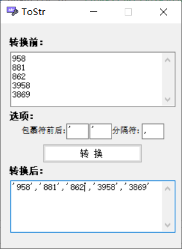

	

<h2 align="center">数据库列转逗号分隔字符串小工具</h2>

### 用法

	1.双击运行ToStr.exe
	2.复制数据库某一列的值将数据复制到转换前输入框后点击“转换”

### 效果预览
	

### 版本说明

- v1.0.2

	优化代码

- v1.0.1

	1.添加图标

	2.增加转换选项

	3.优化代码

- v1.0.0

	基础字符串转换功能
  

